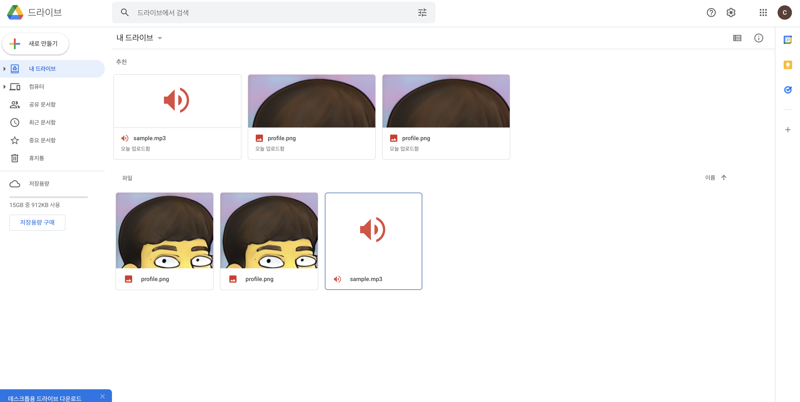

# Google-Drive based static server

- using [google-drive-api v3](https://developers.google.com/drive/api/v3/quickstart/python)
- using python3.x

image와 audio 파일들을 upload하고 serving할 수 있는 서버가 필요했다.
물론 aws와 `s3`같은 스토리지 서비스를 사용하면 되지만, 공짜로 이를 수행할 수 있는 서버가 필요했기 때문에 구글 드라이브를 택했다.

구글 드라이브에서 무료로 제공하는 15GB는 간단한 이미지 파일(약 90kb)의 경우 10만개 정도 서빙해줄 수 있다.



## Prerequisites

> 주의할점은 desktop app으로 credentia을 설치해야하며, oauth를 localhost로 두어야 한다.

1. setup python environment

```bash
$ python -m venv .venv && . .venv/bin/activate && pip3 install --upgrade pip
$ pip install --upgrade google-api-python-client google-auth-httplib2 google-auth-oauthlib
```

2. A Google Cloud Platform project with the API enabled. To create a project and enable an API, refer to [Create a project and enable the API](https://developers.google.com/workspace/guides/create-project)
3. Authorization credentials for a desktop application. To learn how to create credentials for a desktop application, refer to [Create credentials](https://developers.google.com/workspace/guides/create-credentials).
   - check https://github.com/googleapis/google-api-python-client/blob/main/docs/client-secrets.md
   - [로컬에서 google oauth 지정하는법](https://devdiary.tistory.com/6)
4. A Google account with Google Drive enabled.
